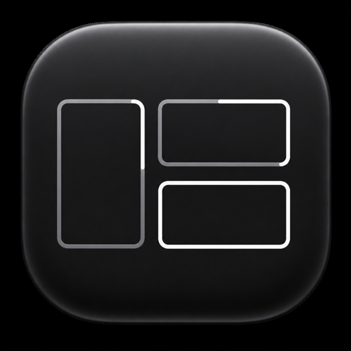
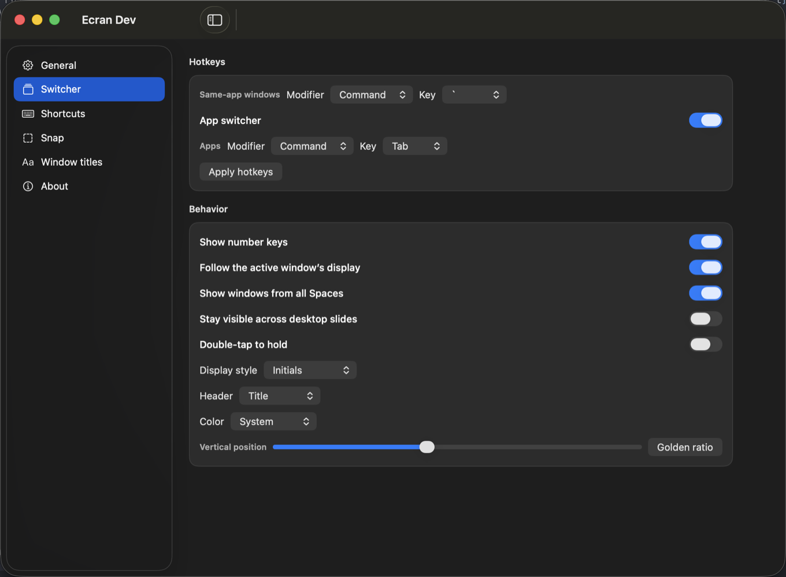

<p align="center">
  
</p>

<h1 align="center">Ecran</h1>

<p align="center">
  Switch, snap, and place every window on your Mac.
</p>

<p align="center">
  
</p>

Ecran is a menu-bar window manager and list-only switcher. It combines
Lineup’s same-app and app switchers with Rectangle’s keyboard placements,
snap areas, and multi-window arrange actions. There is no Dock icon.
Nothing leaves this machine.

[Download 0.1.0-beta.1](https://github.com/basique-industrie/ecran/releases)
for macOS 26 (universal).
[CI](https://github.com/basique-industrie/ecran/actions/workflows/ci.yml)
· [Releases](https://github.com/basique-industrie/ecran/releases)

## Install

1. [Download the latest release](https://github.com/basique-industrie/ecran/releases).
2. Unzip it and move **Ecran.app** to **Applications**.
3. Open **Ecran**. Grant **Accessibility** when macOS asks.

The notarized zip is signed. A local `scripts/package.sh` build is **Ecran Dev**:
a different bundle ID, isolated settings, and a stable local signature so
Accessibility and Screen Recording survive rebuilds next to `/Applications/Ecran.app`.

## Switcher

- Same-app window switcher (default `⌘ + \``) with project-name extraction
- App switcher (default `⌘ + Tab`) that can replace the system Command-Tab hold
- List-only rows, arrow keys, Enter, Esc, and 1–9
- Windows from every Space, including minimized Dock windows
- Display styles: app icon, initials, or live preview
- Double-tap to hold, follow the active display, and stay visible across desktop slides

## Placement

- Halves, thirds, fourths, sixths, eighths, ninths, twelfths, and sixteenths
- Maximize, almost maximize, center, restore, and specified size
- Next and previous display, plus jump to displays 1–9
- Tile, cascade, reverse, and todo-sidebar placements
- Drag-to-edge snap with a footprint, unsnap-on-drag, sixths, and thirds cycling
- Ignore an app’s placement shortcuts without disabling the switcher
- Title-bar double-click and optional green zoom-button override
- URL actions: `ecran://execute-action?name=left-half`

Recommended shortcuts are ⌃⌥ arrows for halves, ⌃⌥ U/I/J/K for corners, and
⌃⌥ Return to maximize. Import and export a JSON configuration from Settings.

## Build from source

macOS 26 SDK and a Swift 6.2 toolchain:

```bash
./scripts/run.sh
```

That packages and opens **Ecran Dev** (`dist/Ecran Dev.app`). Leave the GitHub
**Ecran.app** in Applications if you want both running.

| Command | Purpose |
| --- | --- |
| `./scripts/run.sh` | Package and open Ecran Dev |
| `./scripts/run.sh --open-settings` | Open Settings on launch |
| `swift test` | Not used; the suite is a standalone executable |
| `./scripts/test.sh` | Regression and security suites |
| `./scripts/check-public-release.sh` | Public-release hygiene |
| `./scripts/package.sh` | Signed `dist/Ecran Dev.app` (TCC persists) |
| `./scripts/package.sh --shipped` | Signed `dist/Ecran.app` |
| `./scripts/release.sh` | Signed, notarized zip from a matching tag |

## Local data

| Data | Shipped Ecran | Ecran Dev |
| --- | --- | --- |
| Settings | `~/.ecran/settings.json` | `~/.ecran-dev/settings.json` |
| Redacted logs | `~/Library/Logs/Ecran/` | `~/Library/Logs/Ecran-Dev/` |

Network activity is none. Accessibility is required. Screen Recording is
optional and used only for live switcher previews.

## Documentation

| Document | Audience and scope |
| --- | --- |
| [Architecture](ARCHITECTURE.md) | Module boundaries and reliability controls |
| [Release](docs/RELEASE.md) | Versioning, signing, notarization, and publication |
| [Contributing](CONTRIBUTING.md) | Change workflow and documentation expectations |
| [Privacy](PRIVACY.md) | Data processed on the Mac and required-reason APIs |
| [Security](SECURITY.md) | Trust boundaries and reporting |
| [Third-party notices](THIRD_PARTY_NOTICES.md) | Lineup, Rectangle, and generated artwork |

## License and trademarks

Code is available under the [MIT License](LICENSE). Lineup and Rectangle remain
subject to their own MIT notices. The name Ecran is used as a product name for
this window manager; it does not imply affiliation with those projects.
